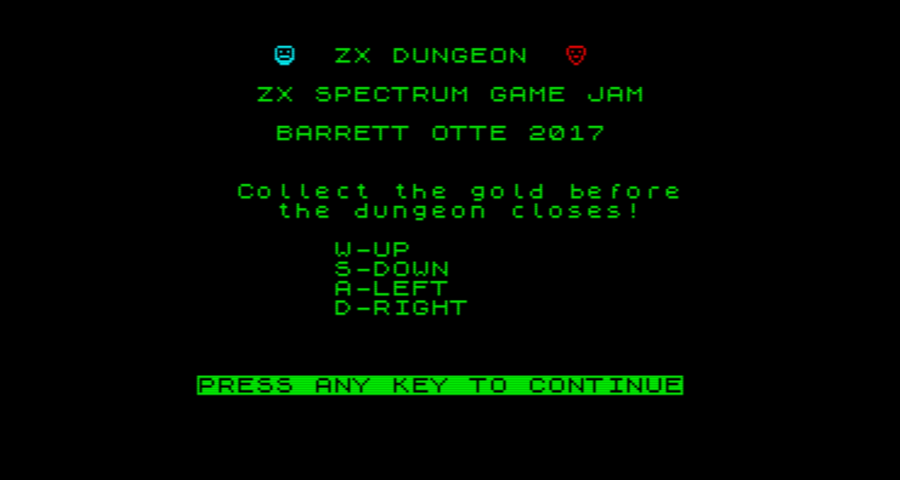
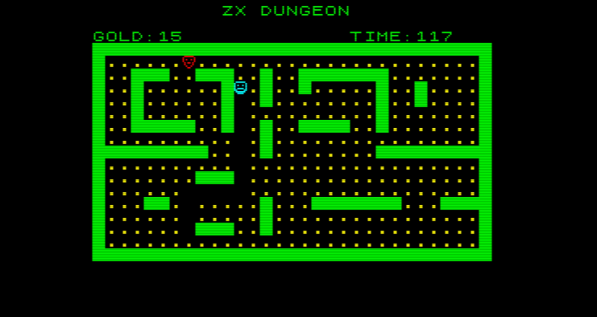

# ZX-Dungeon
* Before the ZX Spectrum Game Jam I had never used BASIC before. 
* After walking myself through the BASin manual and tinkering with a few games, I had a reasonable understanding of the language. 
* This is a fairly simple game where you collect gold and avoid the enemy. 
* It plays a lot like PacMan and is based off of an example located in the ZX Spectrum Coding Club book. 
* I had a lot of fun learning this language.

### [Itch.io Project Page](https://barrettotte.itch.io/zx-dungeon)

### [ZX Spectrum Game Jam Entry](https://itch.io/jam/zx-spectrum-basic-jam/rate/150038)

 

